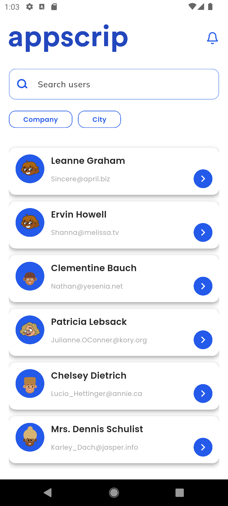
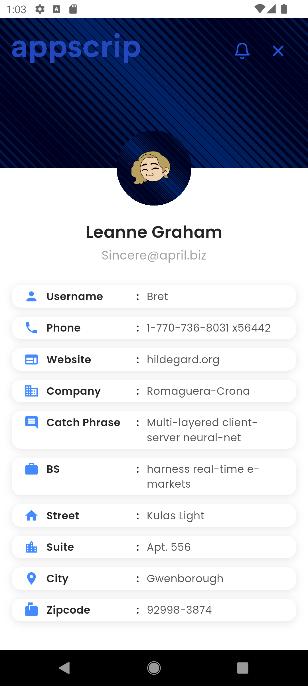
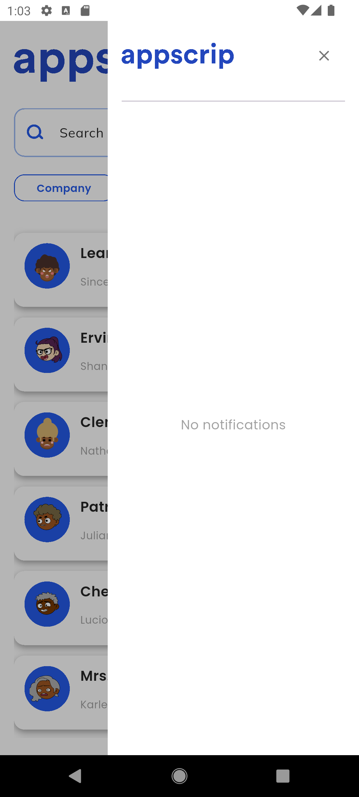
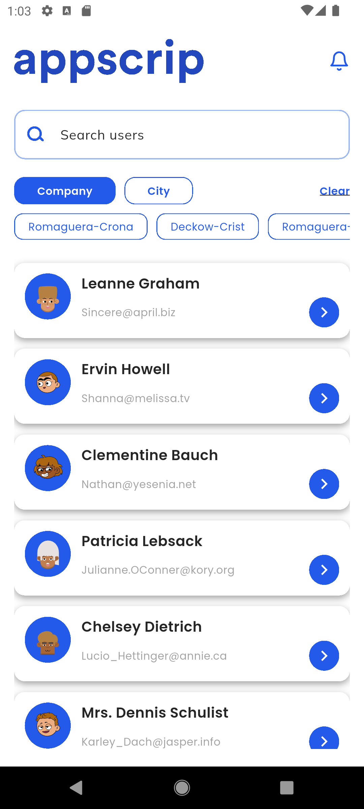
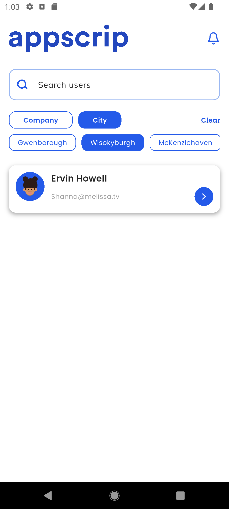
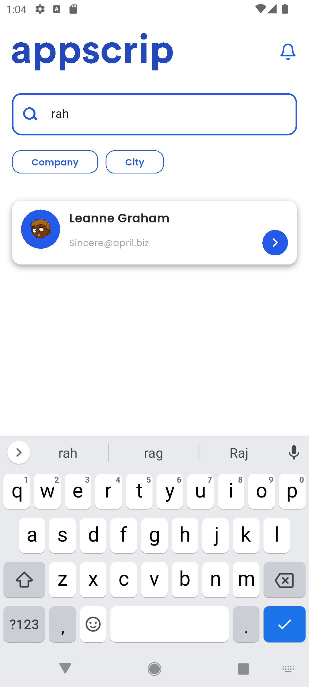
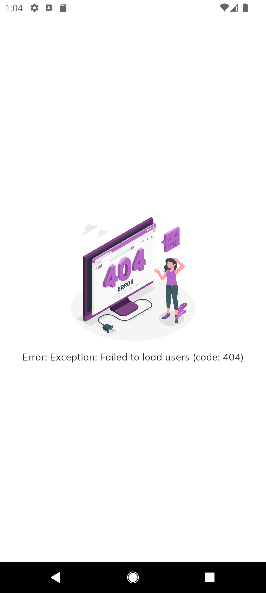

# App Scrip Userlist (Flutter + Bloc)

A Flutter application demonstrating user listing, filtering, searching, and details view with state management using **Cubit (Bloc)**.  
The app fetches user data from an API and displays it in a clean UI with error handling and retry support.

---  ## Features ---

- Fetch and display a list of users from an API.
- Search users by **name** or **email**.
- Filter users by **Company** or **City**.
- Select a user to view detailed profile information.
- Error handling with retry option.
- Pull-to-refresh functionality.


--- ##  Tech Stack ---

- Flutter 
- Dart  
- Bloc (Cubit) State Management
- Postman
- GitHub

--- ## How to Run ---

1. **Install Flutter**
   - [Download Flutter](https://docs.flutter.dev/get-started/install) and add it to your PATH.  
   - Check setup:
     ```bash
     flutter doctor
     ```

2. **Clone this repo**
   ```bash
   git clone https://github.com/YOUR_USERNAME/app_scrip_bloc.git
   cd app_scrip_bloc

--- ## Assumptions & Decisions ---

- The user filtering feature is implemented on the **already fetched list of users** instead of calling the API again.  
  - This avoids unnecessary API calls.  
  - Improves performance and ensures faster search/filter experience.  
  - It assumes that the user dataset is not too large to handle in memory.

  --- ## Screenshots ---

| Dashboard | User Details | Notifications | Category |
|------|--------|------------|-----------|
|  |  |  |  |

| Categories | Searchbar | Error State |
|--------------|---------------|-------------|
|  |  |  |


